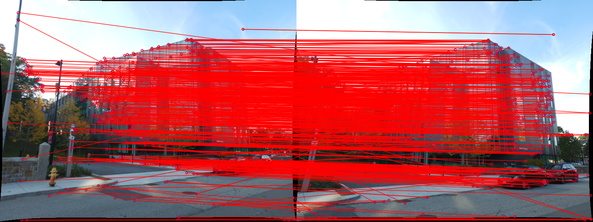
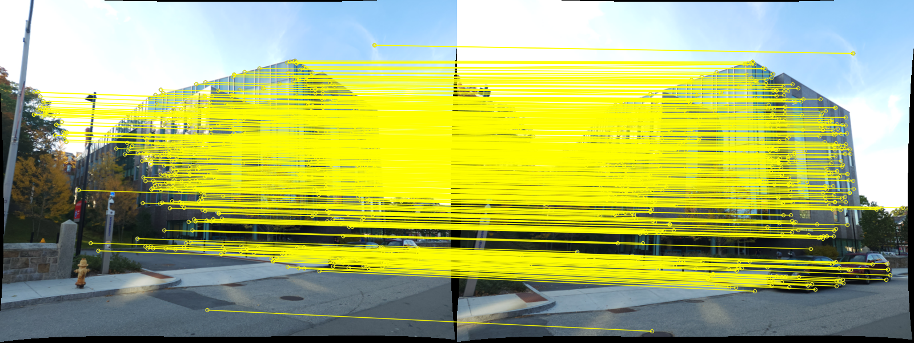
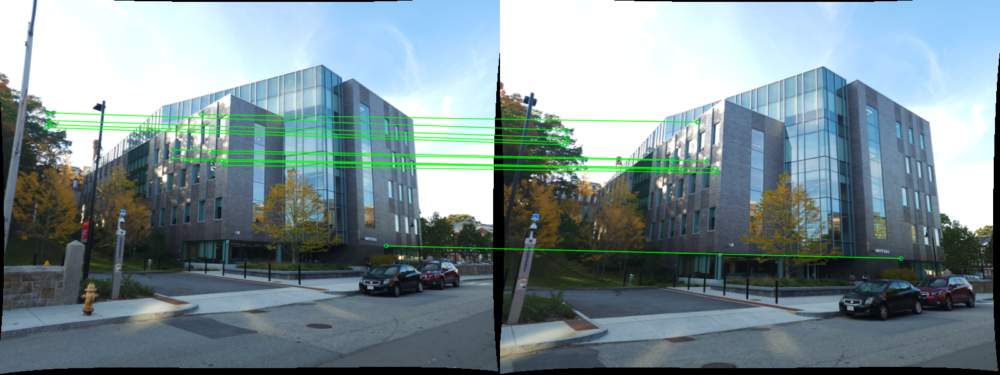
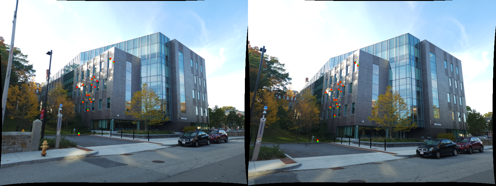
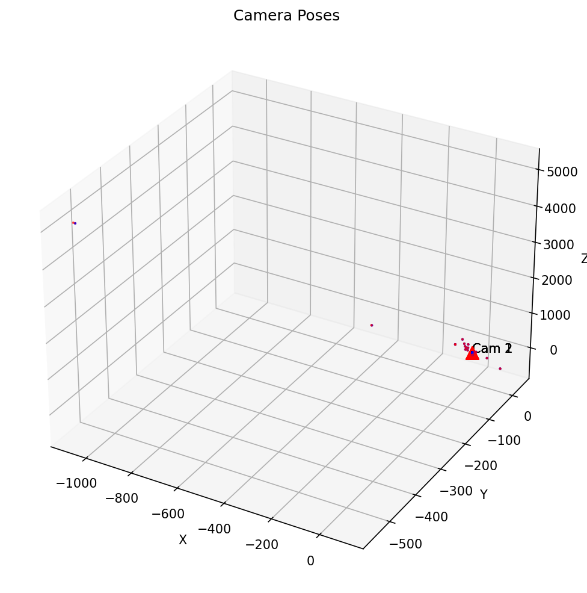

# Structure from Motion (SfM) Pipeline

A complete implementation of a Structure from Motion pipeline that reconstructs 3D scene structure and camera poses from multiple 2D images. This project implements the full SfM pipeline from feature matching to bundle adjustment, including fundamental matrix estimation, camera pose extraction, triangulation, and optimization.

## Overview

Structure from Motion is a computer vision technique that simultaneously estimates:
- **3D structure** of a scene (3D point cloud)
- **Camera poses** (position and orientation) for each image

This implementation processes multiple images with known feature correspondences and reconstructs the 3D scene using geometric constraints and optimization techniques.

## Pipeline Overview

The SfM pipeline consists of the following main stages:

1. **Feature Matching & Outlier Rejection**
   - Extract original feature matches between image pairs
   - Filter matches using homography estimation (for planar scenes)
   - Apply RANSAC with fundamental matrix estimation to find robust inliers

2. **Camera Pose Estimation**
   - Estimate fundamental matrix from point correspondences
   - Extract essential matrix using camera intrinsics
   - Extract 4 possible camera poses from essential matrix
   - Disambiguate correct pose using cheirality condition

3. **3D Reconstruction**
   - Linear triangulation to estimate initial 3D points
   - Non-linear triangulation to refine 3D point positions
   - Perspective-n-Point (PnP) for adding new cameras
   - Non-linear PnP refinement

4. **Bundle Adjustment**
   - Joint optimization of all camera poses and 3D points
   - Minimizes reprojection errors across all images

## Key Components

### Core Modules

- **`EstimateFundamentalMatrix.py`**: Implements the 8-point algorithm with Hartley normalization to estimate the fundamental matrix from point correspondences.

- **`GetInliersRANSAC.py`**: Uses RANSAC to robustly find inliers for fundamental matrix estimation, filtering out outliers.

- **`GetHomographyInliers.py`**: Estimates homography matrices and finds inliers for planar scene detection.

- **`EssentialMatrixFromFundamentalMatrix.py`**: Converts fundamental matrix to essential matrix using camera intrinsics.

- **`ExtractCameraPose.py`**: Extracts 4 possible camera poses from the essential matrix using SVD.

- **`DisambiguateCameraPose.py`**: Selects the correct camera pose from 4 possibilities using the cheirality condition (ensuring 3D points are in front of cameras).

- **`LinearTriangulation.py`**: Estimates initial 3D point positions using Direct Linear Transform (DLT).

- **`NonLinearTriangulation.py`**: Refines 3D point positions using non-linear optimization to minimize reprojection errors.

- **`LinearPnP.py`**: Estimates camera pose from 3D-2D correspondences using linear PnP (DLT).

- **`NonlinearPnP.py`**: Refines camera pose using non-linear optimization.

- **`PnPRANSAC.py`**: Robustly estimates camera pose using RANSAC with PnP.

- **`BundleAdjustment.py`**: Performs joint optimization of all camera poses and 3D points to minimize global reprojection errors.

- **`BuildVisibilityMatrix.py`**: Constructs visibility matrix indicating which 3D points are visible in which cameras.

- **`Utils.py`**: Utility functions for:
  - Loading feature data from matching files
  - Drawing feature matches and visualizations
  - Plotting 3D world coordinates
  - Plotting camera poses
  - Visualizing reprojections
  - Camera pose disambiguation wrapper

### Main Script

- **`Wrapper_dev.py`**: Main orchestration script that runs the complete SfM pipeline.

## Results

The pipeline generates several types of visualizations:

### Feature Matching Results

#### Original Feature Matches
All detected feature correspondences between image pairs:


#### Homography Inliers
Feature matches that satisfy homography constraints (useful for planar scenes):


#### RANSAC Inliers
Robust feature matches after fundamental matrix-based RANSAC filtering:


### 3D Reconstruction Results

#### Possible Camera Poses
Four possible camera pose configurations extracted from the essential matrix:


#### Corrected 3D Structure
3D point cloud after selecting the correct camera pose:


#### Refined 3D Structure
3D points after non-linear triangulation refinement:


#### Camera Poses Visualization
3D visualization showing camera positions and orientations:


### Reprojection Visualization

#### Corrected Reprojections
Comparison of observed (green) vs. reprojected (red) points after initial pose estimation:


#### Refined Reprojections
Reprojection errors after non-linear refinement:


### Bundle Adjustment Results

#### Before Bundle Adjustment
3D structure before global optimization:


#### After Bundle Adjustment
3D structure after joint optimization of all cameras and points:


#### Bundle Adjustment with Camera Poses
Final optimized 3D structure with all camera poses:


## Usage

### Prerequisites

```bash
pip install numpy opencv-python matplotlib scipy
```

### Running the Pipeline

```bash
python Wrapper_dev.py --data_path P3Data/ --results_dir P3Data/Results
```

### Arguments

- `--data_path`: Path to directory containing images and matching text files (default: `P3Data/`)
- `--results_dir`: Directory to save output visualizations (default: `P3Data/Results`)

### Input Data Format

The pipeline expects:
- **Images**: PNG files named `1.png`, `2.png`, etc.
- **Feature Matches**: Text files named `matching1.txt`, `matching2.txt`, etc. containing feature correspondences
- **Camera Calibration**: Camera intrinsic matrix `K` (loaded from calibration data)

### Output Structure

Results are organized as follows:
```
Results/
├── original_matches/          # All feature matches
├── homography_matches/        # Homography-filtered matches
├── ransac_matches/            # RANSAC-filtered matches
├── 1_2/                       # Results for image pair 1-2
│   ├── possible_world_coords.png
│   ├── corrected_world_coords.png
│   ├── refined_world_coords.png
│   ├── with_camera_pose.png
│   ├── corrected_reprojections.png
│   └── refined_reprojections.png
├── before_BA.png             # Before bundle adjustment
├── BA.png                     # After bundle adjustment
└── BA_with_camera_pose.png    # Final result with cameras
```

## Technical Details

### Algorithms Implemented

1. **8-Point Algorithm**: Fundamental matrix estimation with Hartley normalization
2. **RANSAC**: Robust outlier rejection for fundamental matrix and homography
3. **SVD-based Pose Extraction**: Camera pose extraction from essential matrix
4. **Cheirality Check**: Disambiguation of camera poses using depth constraints
5. **Direct Linear Transform (DLT)**: Linear triangulation and PnP
6. **Non-linear Optimization**: Levenberg-Marquardt optimization for refinement
7. **Bundle Adjustment**: Large-scale non-linear optimization using sparse least squares

### Key Parameters

- **RANSAC Threshold**: 0.06 (for fundamental matrix), 30 (for homography)
- **RANSAC Iterations**: 1000
- **PnP Threshold**: 200 pixels
- **Optimization Tolerance**: 1e-8

## Project Structure

```
Structure-from-Motion-/
├── Wrapper_dev.py              # Main pipeline script
├── Utils.py                    # Utility functions
├── EstimateFundamentalMatrix.py
├── GetInliersRANSAC.py
├── GetHomographyInliers.py
├── EssentialMatrixFromFundamentalMatrix.py
├── ExtractCameraPose.py
├── DisambiguateCameraPose.py
├── LinearTriangulation.py
├── NonLinearTriangulation.py
├── LinearPnP.py
├── NonlinearPnP.py
├── PnPRANSAC.py
├── BundleAdjustment.py
├── BuildVisibilityMatrix.py
├── P3Data/                     # Input data
│   ├── 1.png, 2.png, ...
│   ├── matching1.txt, ...
│   └── Results/               # Output results
└── README.md
```

## References

- Hartley, R., & Zisserman, A. (2003). *Multiple View Geometry in Computer Vision*. Cambridge University Press.
- Szeliski, R. (2010). *Computer Vision: Algorithms and Applications*. Springer.

## License

See LICENSE file for details.
